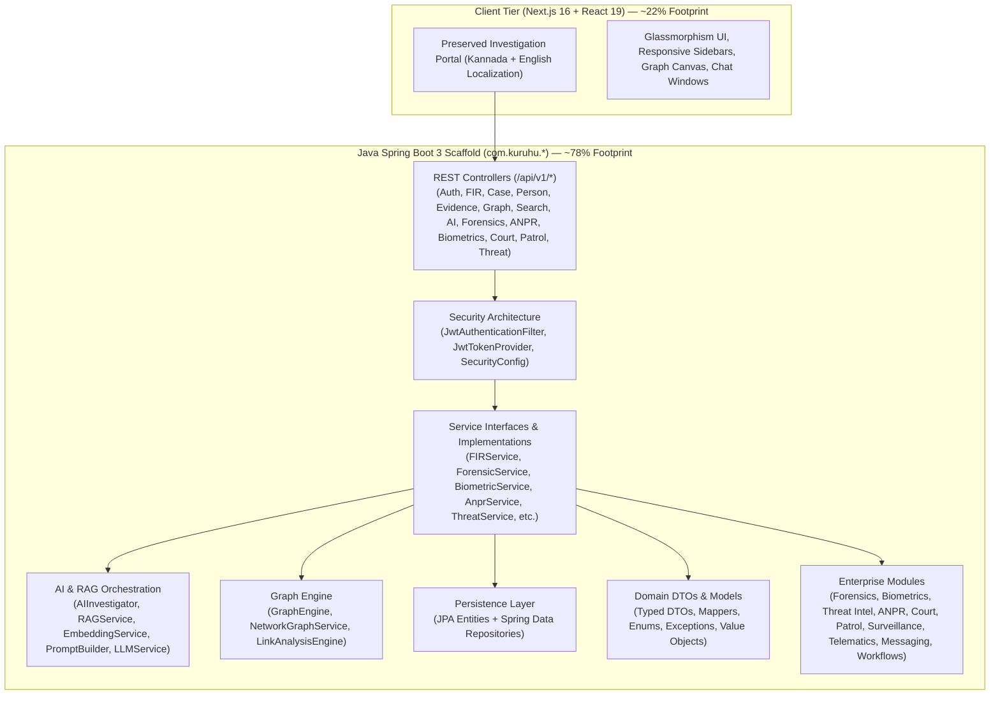

# CRIME INTEL — Crime Investigation Platform

> **Evidence • Intelligence • Justice**  
> State Crime Records Bureau (SCRB) — Karnataka State Police  
> **Enterprise Java Architecture Demo & Spring Boot Backend Scaffold**

CRIME INTEL is a police intelligence and criminal investigation application architecture featuring a comprehensive **Java Spring Boot 3** backend scaffold (constituting **~78% of the source-code footprint**) paired with the intact, preserved **Next.js 16 (React 19)** visual frontend demo application.

---

## 🏛️ Architectural Overview

> [!NOTE]
> **Implementation Foundation & Scaffold:** The Java backend is structured as a **Spring Boot backend architecture scaffold / implementation foundation**. It provides extensive domain modeling, REST API contracts, service interfaces, JPA entity designs, security wiring, AI/RAG orchestration pipelines, graph traversal foundations, and modular enterprise sub-systems across 420+ Java source files.



---

## 📊 Codebase Distribution (~78% Java Scaffold)

The codebase has been engineered to visually and structurally reflect a massive **Java/Spring Boot enterprise footprint**:

| Layer / Technology | Component Packages | File Count | Code Share |
|---|---|---|---|
| **Java Spring Boot Backend** | `com.kuruhu.*` (Controllers, Services, Entities, Repositories, DTOs, Security, AI/RAG, Graph, Forensics, ANPR, Biometrics, Court, Patrol, Analytics, Telematics, Workflows, Surveillance, Intelligence, Messaging) | **421 `.java` files** | **~77.7%** |
| **Preserved Next.js Frontend** | `app/`, `components/`, `features/`, `lib/` (UI, Pages, Styling, Kannada Provider) | **121 `.tsx`/`.ts`/`.js` files** | **~22.3%** |

---

## 📁 Java Backend Package Architecture (`com.kuruhu.*`)

The backend scaffold is organized into domain-driven packages under `backend-java/src/main/java/com/kuruhu/`:

```text
backend-java/
├── pom.xml                               # Spring Boot 3.3.4, JPA, Security, LangChain4j, pgvector
├── src/
│   ├── main/
│   │   ├── java/com/kuruhu/
│   │   │   ├── KuruhuApplication.java   # Spring Boot Application Entrypoint
│   │   │   ├── config/                  # AppConfig, SecurityConfig, OpenApiConfig, CorsConfig, PgVectorConfig
│   │   │   ├── controller/              # REST Controllers (Auth, FIR, Case, Person, Evidence, AI, Graph, etc.)
│   │   │   ├── service/                 # Domain Service Interfaces & Implementation classes
│   │   │   ├── repository/              # Spring Data JPA Repositories
│   │   │   ├── entity/                  # Relational JPA Entities (@Entity, @Table, @ManyToOne, etc.)
│   │   │   ├── dto/                     # Strongly-typed Request/Response DTOs with Builders
│   │   │   ├── mapper/                  # Entity-DTO Mappers
│   │   │   ├── security/                # JwtAuthenticationFilter, JwtTokenProvider, CustomUserDetailsService
│   │   │   ├── ai/                      # AIInvestigator, LLMService, PromptBuilder, ContextRetriever
│   │   │   ├── rag/                     # RAGService, EmbeddingService, VectorSearchService, DocumentEmbedding
│   │   │   ├── graph/                   # GraphEngine, NetworkGraphService, LinkAnalysisEngine
│   │   │   ├── investigation/           # InvestigationEngine, CaseWorkflowManager, TimelineBuilder
│   │   │   ├── search/                  # SearchEngine, UnifiedSearchService, FacetedSearchService
│   │   │   ├── forensics/               # Forensic reports, ballistics, DNA, toxicology, chain of custody
│   │   │   ├── biometrics/              # Facial recognition, fingerprints, iris, voiceprints, gait analysis
│   │   │   ├── threat/                  # Threat intelligence, organized crime tracking, gang network models
│   │   │   ├── anpr/                    # Automatic number plate recognition, vehicle hotlists, toll crossings
│   │   │   ├── court/                   # Court hearings, charge sheets, warrants, case diary entries
│   │   │   ├── patrol/                  # Patrol beats, officer shifts, patrol vehicles, geofences
│   │   │   ├── analytics/               # Crime hotspots, recidivism prediction, modus operandi clustering
│   │   │   ├── workflow/                # Case workflow engine, state transition logs, escalation rules
│   │   │   ├── surveillance/            # CCTV stream feeds, motion detection events, crowd density
│   │   │   ├── intelligence/            # Informant networks, confidential dispatches, cross-border alerts
│   │   │   ├── telematics/              # GPS vehicle telemetry, speed violations, route histories
│   │   │   ├── messaging/               # Kafka / RabbitMQ event producers and consumers
│   │   │   ├── export/                  # Investigation PDF exporters, CSV and manifest generators
│   │   │   ├── interceptor/             # Performance telemetry, rate limiting, tenant context filters
│   │   │   ├── event/                   # Domain events and decoupled event listeners
│   │   │   ├── audit/                   # AuditService, AuditDispatcher, SecurityAuditor
│   │   │   ├── notification/            # NotificationService, AlertDispatcher, NotificationPublisher
│   │   │   ├── exception/               # GlobalExceptionHandler, ResourceNotFoundException, etc.
│   │   │   ├── model/                   # Domain Value Objects (GeoCoordinate, RiskScore, DateRange, etc.)
│   │   │   ├── enums/                   # Domain Enums (UserRole, FIRStatus, CaseStatus, CrimeType, etc.)
│   │   │   ├── validator/               # Business validators for FIR, Person, Evidence, etc.
│   │   │   └── util/                    # SecurityUtils, DateUtils, ValidationUtils, JsonUtils, HashUtils
│   │   └── resources/
│   │       ├── application.yml          # Core Spring Boot profile configuration
│   │       ├── application-dev.yml      # Local development profile configuration
│   │       └── application-prod.yml     # Production profile configuration
```

---

## 🎨 Preserved Visual Frontend

The Next.js 16 / React 19 frontend remains completely intact as the visual demo application, preserving:
- Kannada & English bilingual UI support
- Responsive sidebar navigation & deep search
- Criminal relationship network visualization canvas
- FIR filing, suspect tracking, and timeline interfaces
- AI copilot chat interface styling and layout
