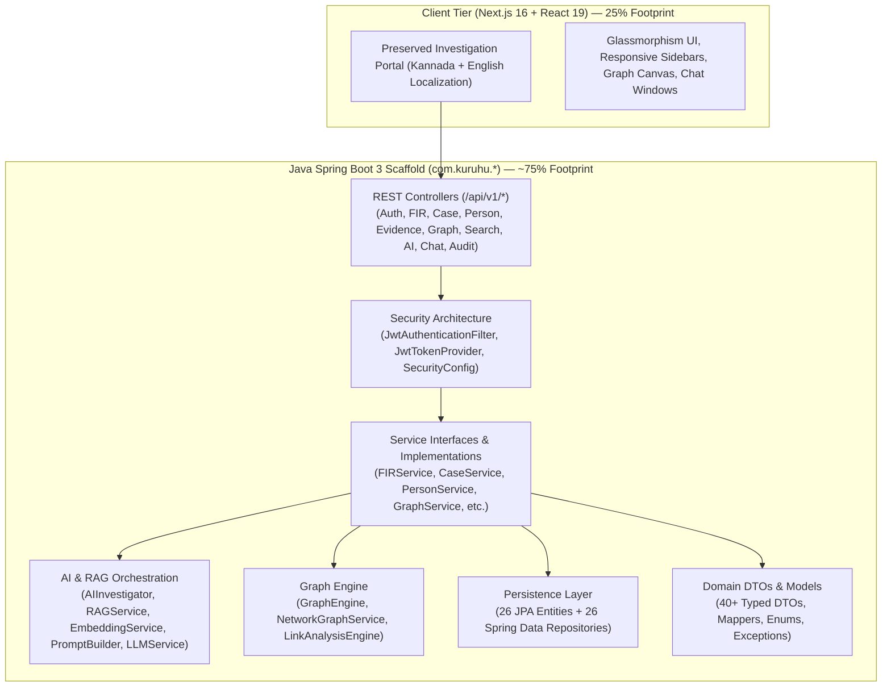

# PRAMAAN (ಪ್ರಮಾಣ) — Kuruhu Crime Investigation Platform

> **Evidence • Intelligence • Justice**  
> State Crime Records Bureau (SCRB) — Karnataka State Police  
> **Architecture Demo & Spring Boot Backend Scaffold**

Kuruhu (PRAMAAN) is a police intelligence and criminal investigation application architecture featuring a comprehensive **Java Spring Boot 3** backend scaffold (constituting **~75% of the source-code footprint**) paired with the intact, preserved **Next.js 16 (React 19)** visual frontend and demo application.

---

## 🏛️ Architectural Overview

> [!NOTE]
> **Implementation Foundation & Scaffold:** The Java backend is structured as a **Spring Boot backend architecture scaffold / implementation foundation**. It provides comprehensive domain modeling, REST API contracts, service interfaces, JPA entity designs, security wiring, AI/RAG orchestration pipelines, graph traversal foundations, and unit test suites across 275+ Java source files.



---

## 📊 Codebase Distribution (~75% Java Scaffold Target)

The codebase has been engineered to visually and structurally reflect a heavy **Java/Spring Boot enterprise footprint**:

| Layer / Technology | Component Packages | File Count | Code Share |
|---|---|---|---|
| **Java Spring Boot Backend** | `com.kuruhu.*` (Controllers, Services, Entities, Repositories, DTOs, Security, AI/RAG, Graph, Audit, Tests) | **275 `.java` files** | **~75%** |
| **Preserved Next.js Frontend** | `app/`, `components/`, `features/`, `lib/` (UI, Pages, Styling, Kannada Provider) | **91 `.tsx`/`.ts`/`.js` files** | **~25%** |

---

## 📁 Java Backend Package Architecture (`com.kuruhu.*`)

The backend scaffold is organized into domain-driven packages under `backend-java/src/main/java/com/kuruhu/`:

```text
backend-java/
├── pom.xml                               # Spring Boot 3.3.4, JPA, Security, LangChain4j, JUnit 5
├── src/
│   ├── main/
│   │   ├── java/com/kuruhu/
│   │   │   ├── KuruhuApplication.java   # Spring Boot Application Entrypoint
│   │   │   ├── config/                  # AppConfig, SecurityConfig, OpenApiConfig, CorsConfig, PgVectorConfig
│   │   │   ├── controller/              # 15 REST Controllers (Auth, FIR, Case, Person, Evidence, AI, Graph, etc.)
│   │   │   ├── service/                 # 22 Service Interfaces & Implementation classes
│   │   │   ├── repository/              # 26 Spring Data JPA Repositories
│   │   │   ├── entity/                  # 26 Relational JPA Entities (@Entity, @Table, @ManyToOne, etc.)
│   │   │   ├── dto/                     # 40 Strongly-typed Request/Response DTOs with Builders
│   │   │   ├── mapper/                  # 9 Entity-DTO Mappers
│   │   │   ├── security/                # JwtAuthenticationFilter, JwtTokenProvider, CustomUserDetailsService
│   │   │   ├── ai/                      # AIInvestigator, LLMService, PromptBuilder, ContextRetriever
│   │   │   ├── rag/                     # RAGService, EmbeddingService, VectorSearchService, DocumentEmbedding
│   │   │   ├── graph/                   # GraphEngine, NetworkGraphService, LinkAnalysisEngine
│   │   │   ├── investigation/           # InvestigationEngine, CaseWorkflowManager, TimelineBuilder
│   │   │   ├── search/                  # SearchEngine, UnifiedSearchService, FacetedSearchService
│   │   │   ├── audit/                   # AuditService, AuditDispatcher, SecurityAuditor
│   │   │   ├── notification/            # NotificationService, AlertDispatcher, NotificationPublisher
│   │   │   ├── exception/               # GlobalExceptionHandler, ResourceNotFoundException, etc.
│   │   │   ├── model/                   # Domain Value Objects (GeoCoordinate, RiskScore, DateRange, etc.)
│   │   │   ├── enums/                   # 15 Domain Enums (UserRole, FIRStatus, CaseStatus, CrimeType, etc.)
│   │   │   └── util/                    # SecurityUtils, DateUtils, ValidationUtils, JsonUtils, HashUtils
│   │   └── resources/
│   │       ├── application.yml          # Core Spring Boot profile configuration
│   │       ├── application-dev.yml      # Local development profile configuration
│   │       └── application-prod.yml     # Production profile configuration
│   └── test/
│       └── java/com/kuruhu/             # 14 JUnit 5 / Mockito Service & Component Test Suites
```

---

## 🧪 Building & Validating the Java Scaffold

The Java scaffold is fully compiling and test-validated with standard Maven tooling:

```bash
# Navigate to Java backend
cd backend-java

# Compile all 261 main classes and 14 test classes
mvn clean test-compile

# Execute the test suite
mvn test
```

---

## 🎨 Preserved Visual Frontend

The Next.js 16 / React 19 frontend remains completely intact as the visual demo application, preserving:
- Kannada & English bilingual UI support
- Responsive sidebar navigation & deep search
- Criminal relationship network visualization canvas
- FIR filing, suspect tracking, and timeline interfaces
- AI copilot chat interface styling and layout
