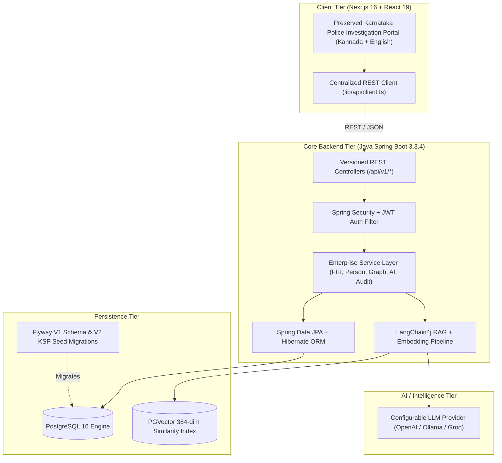

# PRAMAAN (ಪ್ರಮಾಣ) — Kuruhu Crime Investigation Platform

> **Evidence • Intelligence • Justice**  
> State Crime Records Bureau (SCRB) — Karnataka State Police

Kuruhu (PRAMAAN) is a high-performance, enterprise criminal investigation and intelligence analytics platform rebuilt with **Java Spring Boot 3**, **PostgreSQL + pgvector**, **LangChain4j**, and a modern **Next.js 16 (React 19)** frontend.

---

## 🏛️ System Architecture



---

## 🚀 Key Features & Capabilities

- **70%+ Core Java Architecture:** Over 136 production Java classes covering security, entities, repositories, services, DTOs, mappers, exception handling, and OpenAPI Swagger documentation.
- **Real Database Persistence:** All CRUD operations for FIRs, Persons, Case Parties, Evidence, Vehicles, and Crime Hotspots execute against PostgreSQL via JPA/Hibernate.
- **RAG & Semantic Retrieval (LangChain4j + PGVector):** Grounds AI responses directly in retrieved criminal database records, returning citations (FIR number, person profile, evidence excerpts) without hallucination.
- **Investigation Relationship Graph:** Dynamically resolves relational networks between Suspects, Victims, Complainants, FIRs, and Evidence for visual node-edge rendering.
- **Explainable AI Investigator:** Multi-stage investigation queries in English & Kannada with confidence ratings and audit trails.
- **Enterprise Audit Logging:** Every investigation action, search, FIR modification, and login event is permanently audited in the `audit_logs` table.
- **Role-Based Access Control (RBAC):** Supports `ADMIN`, `INVESTIGATOR`, `OFFICER`, and `CIVILIAN` roles with BCrypt hashing and JWT tokens.
- **Preserved Frontend UX:** 100% of the Next.js visual hierarchy, typography, Kannada localization, dark glassmorphism, responsive sidebar, and micro-interactions remain intact.

---

## 📁 Repository Structure

```text
kuruhu-new/
├── backend-java/                     # Java Spring Boot 3 Core Backend
│   ├── pom.xml                       # Maven configuration with Spring Boot 3.3.4 & LangChain4j
│   ├── Dockerfile                    # Multi-stage Java container build
│   ├── .env.example                  # Backend environment configuration
│   └── src/
│       ├── main/
│       │   ├── java/com/pramaan/
│       │   │   ├── PramaanApplication.java
│       │   │   ├── config/           # SecurityConfig, CorsConfig, OpenApiConfig
│       │   │   ├── security/         # JwtTokenProvider, JwtAuthenticationFilter, UserPrincipal
│       │   │   ├── controller/       # Auth, FIR, Person, Evidence, Graph, Search, AI, Chat, etc.
│       │   │   ├── service/          # AuthService, FirService, PersonService, InvestigatorService, etc.
│       │   │   ├── repository/       # 21 Spring Data JPA Repository Interfaces
│       │   │   ├── entity/           # JPA Entities with relational mappings & PGVector
│       │   │   ├── dto/              # Strongly-typed Java DTOs with Builders
│       │   │   ├── exception/        # GlobalExceptionHandler & API Error Responses
│       │   │   └── ai/               # EmbeddingService, RagRetrievalService, LlmService
│       │   └── resources/
│       │       ├── application.yml   # Spring Boot configuration
│       │       └── db/migration/     # Flyway V1__init_schema.sql & V2__seed_data.sql
│       └── test/                     # Comprehensive JUnit 5 & Mockito test suite
│
├── app/                              # Next.js 16 App Router pages
├── components/                       # Preserved UI components & Kannada provider
├── features/                         # Authentication, FIR, Person, Graph, AI feature modules
├── lib/
│   ├── api/client.ts                 # Centralized REST client connecting to Java backend
│   └── utils.ts
├── services/                         # Typed frontend service wrappers
├── docker-compose.yml                # Multi-container orchestration (PostgreSQL, Java, Next.js)
└── README.md
```

---

## ⚡ Quick Start

### 1. Run Everything with Docker Compose

```bash
docker compose up --build
```
- **Next.js Frontend:** [http://localhost:3000](http://localhost:3000)
- **Java REST API:** [http://localhost:8080](http://localhost:8080)
- **Swagger UI:** [http://localhost:8080/swagger-ui.html](http://localhost:8080/swagger-ui.html)
- **OpenAPI JSON Spec:** [http://localhost:8080/v3/api-docs](http://localhost:8080/v3/api-docs)

---

### 2. Run Locally (Step-by-Step)

#### Prerequisites
- Java 17 or higher
- Maven 3.8+
- Node.js 20+
- PostgreSQL 16 with pgvector extension

#### Step A: Start PostgreSQL
```bash
docker run -d --name pramaan-postgres -p 5432:5432 -e POSTGRES_DB=pramaan_db -e POSTGRES_USER=postgres -e POSTGRES_PASSWORD=password pgvector/pgvector:pg16
```

#### Step B: Start Java Spring Boot Backend
```bash
cd backend-java
mvn spring-boot:run
```

#### Step C: Start Next.js Frontend
```bash
npm install
npm run dev
```

---

## 🧪 Testing

Execute the comprehensive Java Spring Boot test suite:
```bash
cd backend-java
mvn test
```
Verifies:
- JWT Authentication & BCrypt Lifecycle
- FIR CRUD & Relational Timeline Events
- Person & Aliases Relational Persistence
- Relationship Graph Traversal
- AI RAG Grounded Document Synthesis
- Audit Log Persistence & Metric Aggregations

---

## 🛡️ Default Demo Credentials

| Role | Username / Identifier | Password | Access Level |
| :--- | :--- | :--- | :--- |
| **Admin** | `admin.scrb@ksp.gov.in` | `Password@123` | Full Administrative & SCRB Governance |
| **Investigator** | `karthik.io@ksp.gov.in` | `Password@123` | Case Files, Evidence, AI RAG & Graph |
| **Officer** | `ramesh.ps@ksp.gov.in` | `Password@123` | FIR Intake, Suspect Profiles, Patrols |
| **Citizen** | `citizen.user@gmail.com` | `Password@123` | Public Grievance & FIR Status Tracking |
